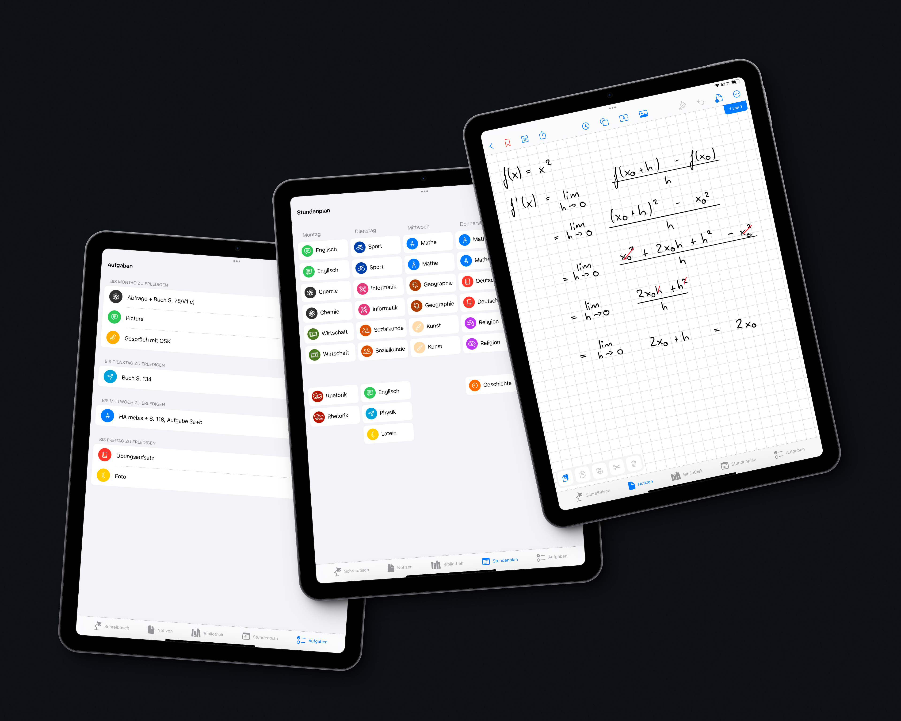

# Productivity Pro

## About
Productivity Pro is developed by students specifically for students to make their everyday school life easier. The app enables users to take notes, create schedules and organize their tasks. It is based on SwiftUI and some components from UIKit, including `PencilKit` & `PDFKit`.\
Productivity Pro is available on the [App Store](https://apps.apple.com/us/app/productivity-pro/id6449678571) for iPad.

## Contact 
If you have any questions, suggestions or anything similar, just let me know via [email](mailto:support@stoobit.com).
